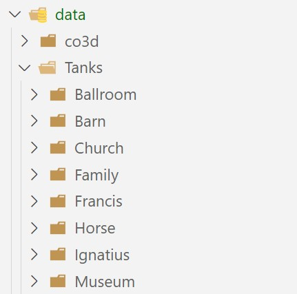
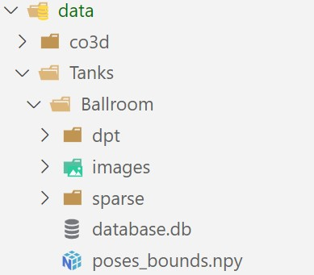
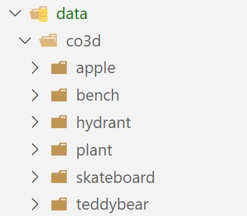
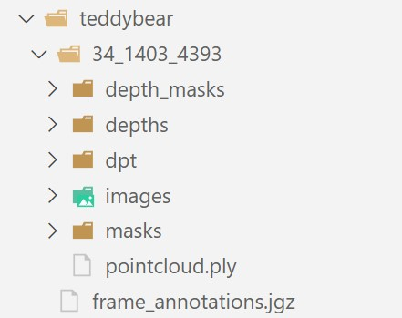

# SfM-Free 3D Gaussian Splatting via Hierarchical Training


# Table of Contents
- [Useful Links](#useful-links)
- [Installation](#installation)
- [Quick Start](#quick-start)
  - [Train](#train)
  - [Evaluation](#evaluation)
- [Details](#details)
  - [Configuration](#configuration)
  - [Notes on Training](#notes-on-training)
  - [Custom Dataset](#custom-dataset)
  - [Merging Operations](#merging-operations)
- [Future Directions](#future-directions)
- [Acknowledgement](#acknowledgement)

---

## Useful Links
+ [Arxiv](https://arxiv.org/abs/2412.01553) 
+ Datasets:
    + [Tanks & Temples](https://www.robots.ox.ac.uk/~wenjing/Tanks.zip)
    + [CO3D-V2](https://www.dropbox.com/scl/fi/6lseati34ch9bx1z67ztu/co3d.zip?rlkey=76ssy7p4c4y8pug94b7z62q3e&st=n554skm5&dl=0)
+ [Pretrained Model & Estimated Pose & Rendered Results](https://www.dropbox.com/scl/fo/5gzinjlld7a0ey8w7q2m5/AMYdul-gQDhWovXT-XcjqIc?rlkey=o8bk1jz8e5cq5ob79hqlwmtsp&st=cx4g3aeu&dl=0) 
+ [Training logs](https://www.dropbox.com/scl/fo/ne20vhcxmhphtzg2rcr7p/AAIzCd23SVCWZ7-EG5mVHk4?rlkey=0xem3cobp4520mxpg6ic01j24&st=64fb6gkb&dl=0)

---

## Installation

### Step 1: Environment Setup
First, clone the repository **recursively**. 
```bash
git clone --recursive https://github.com/jibo27/3DGS_Hierarchical_Training.git
```

Second, install packages following [CF-3DGS](https://github.com/NVlabs/CF-3DGS) or [gaussian_splatting](https://github.com/graphdeco-inria/gaussian-splatting):
+ Unfortunately, we encountered some issues when installing the `diff-gaussian-rasterization` module, so we were unable to fully verify the environment setup. We will address this in a future update.  
+ That said, the required environment is largely similar to [CF-3DGS](https://github.com/NVlabs/CF-3DGS) or [gaussian_splatting](https://github.com/graphdeco-inria/gaussian-splatting). You can refer to these repositories to set up the environment.  
+ Some key packages include:  
  - `diff-gaussian-rasterization`  
  - `git+https://github.com/princeton-vl/lietorch.git`  
  - `git+https://github.com/facebookresearch/pytorch3d.git@stable`  
+ Any other missing modules should be straightforward to install.  


### Step 2: Video Frame Interpolation (VFI)

We use [IFRNet](https://github.com/ltkong218/IFRNet) as the VFI model.

- **Download the pretrained file**: Access the pretrained weights from their shared [link](https://www.dropbox.com/sh/hrewbpedd2cgdp3/AADbEivu0-CKDQcHtKdMNJPJa?dl=0).
  - Our implementation uses the `IFRNet/IFRNet_Vimeo90K.pth`.

- **Place the checkpoint** in the `pretrained/vfi` folder.

Our model loads VFI in the `__init__()` function located in `trainer/trainer.py`. You can use a different checkpoint or other VFI models by modifying the corresponding functions.

### Step 3: Dataset Preparation

#### Tanks and Temples

- Download the preprocessed data by [Nope-NeRF](https://github.com/ActiveVisionLab/nope-nerf/?tab=readme-ov-file#Data):
  ```bash
  wget https://www.robots.ox.ac.uk/~wenjing/Tanks.zip
  ```
- Place the data in the `data/Tanks` folder.

#### CO3D V2

- Since the dataset is very large, you can download the data from our shared [link](https://www.dropbox.com/scl/fi/6lseati34ch9bx1z67ztu/co3d.zip?rlkey=76ssy7p4c4y8pug94b7z62q3e&st=n554skm5&dl=0), which contains only the 5 scenes mentioned in the paper. You are free to explore other videos by downloading them from the [official link](https://github.com/facebookresearch/co3d/blob/main/co3d/links.json).
- Place the data in the `data/co3d` folder.


#### Dataset Structure

Organize the datasets to match the following structure. (Note: Not all files are used.)

```
3DGS_Hierarchical_Training/
├── data/
│   ├── Tanks/
│   ├── co3d/
│   └── ...
└── pretrained/
    └── vfi/
        └── IFRNet_Vimeo90K.pth
```

Example folder visualization:



---

## Quick Start

### Train
To start training, use the following command. The log file is `output/full/Tanks_Francis/output.log`.
```bash
python run.py --mode train --config arguments/full/Tanks/Francis.yml
```

### Evaluation
To evaluate the model, run these commands. The results are saved in `output/full/Tanks_Francis/pose` and `output/full/Tanks_Francis/test`.
```bash
python run.py --mode eval_pose --model_path output/full/Tanks_Francis/chkpnt/model.pth --config arguments/full/Tanks/Francis.yml
python run.py --mode eval_nvs --model_path output/full/Tanks_Francis/chkpnt/model.pth --config arguments/full/Tanks/Francis.yml
```

To evaluate the *pre-trained* model, run these commands. The results are saved in `pretrained/full/Tanks_Francis/pose` and `pretrained/full/Tanks_Francis/test`.
```bash
python run.py --mode eval_pose --model_path pretrained/full/Tanks_Francis/chkpnt/model.pth --config arguments/full/Tanks/Francis.yml
python run.py --mode eval_nvs --model_path pretrained/full/Tanks_Francis/chkpnt/model.pth --config arguments/full/Tanks/Francis.yml
```

---

## Details

### Configuration

Detailed comments on the configuration can be found in the `arguments/full/Tanks/Francis.yml` file.


### Notes on Training

- Training typically takes around 4 hours on our machine, depending on the video length and hardware setup. Detailed training times can be found in the provided training logs. If you want to reduce training time, consider the following approaches:  
  - Parallelization: Our 3DGS training and pose estimation are  independent and can be theoretically executed in parallel to save time.  
  - Disable VFI Support: Set `train_pose_mode: null` and `multi_source_supervision: base` to remove VFI support. Alternatively, reduce the interpolation frequency (e.g., interpolate every 3 frames). This is effective as the interpolation accounts for nearly half of the training time.  
  - Fewer Training Iterations: Reducing the number of training iterations can decrease the training time.  
- The shared training logs are results obtained by rerunning experiments using the current cleaned code. The models corresponding to these logs achieve a performance of 33.41dB on Tanks & Temples, which is similar but not identical to the results reported in the paper (33.53dB). The exact results presented in the paper can be reproduced using the pretrained models available through the shared link above. 
- Empirically, we observe that the training variance for 3DGS is large. As a result, reruning the same experiment can have a quite different result. 

---

### Custom Dataset

#### Step 1: Data Preparation

The code supports three data types: **COLMAP**, **CO3D**, and **images_only**.

**Note**: For `images_only` data, the training and testing partition is performed automatically for the `images_only` (see `setup_dataset` function in `trainer/trainer.py`). If you want to treat all images in `images_only` as training data, set `self.i_test = []`. You may need to adjust other parts of the code accordingly.

- For `images_only` data:
  - Place images into a single folder.
  - Ensure images are sorted sequentially (small camera movement between adjacent frames).
  - Specify a single `FovX` in the YAML file. To assign different `FovX` values for individual frames, you may need to adjust the dataloader.


#### Step 2: Training
The training remains the same. 
For custom datasets, we recommend you to begin with hierarchical training only (without VFI or multi-source supervision) for stability. Update the YAML configuration as follows:
```yaml
train_pose_mode: null
multi_source_supervision: ""
```
If this works well, you can introduce VFI or multi-source supervision.

### Debugging or Poor Performance

1. **Re-run the training**: Sometimes running the training twice resolves the issue.
2. **Compare logs**: Compare your logs with our provided ones when using Tanks & Temples or CO3D datasets to identify the errors.
3. **Custom Data Considerations**:
   - Start with hierarchical training only. Pseudo-images generated by base 3DGS or VFI models may be of low quality if the input data is too complex or of poor quality.
   - Test with different `depth_model_type` settings. For example, we observe that the `zoe` model works well with CO3D, while other depth models yield significantly poor results on CO3D.
   - Adjust densification intervals if the number of 3D Gaussians grows too large. Update:
     ```yaml
     mss_phase1_densification_interval
     mss_phase2_densification_interval
     ```
   - Modify pseudo-view image probabilities using:
     ```yaml
     mss_phase1_ratio
     mss_phase2_ratio
     ```


---

### Merging Operations

If you're specifically interested in the **merge operation**, refer to the `self.merge_two_3DGS()` function in `trainer/ht3dgs_trainer.py`.

--- 


## Future Directions  

There are several promising directions for future work:  
- Developing improved density control, pose estimation and pruning and merging operations.  
- Reducing training time to enhance efficiency.  
- Addressing challenges in complex scenes (artifacts are noticeable in our released results on CO3D).  


---

## Acknowledgement

Our code is built upon the following repositories:
- [Gaussian Splatting](https://github.com/graphdeco-inria/gaussian-splatting)
- [CF-3DGS](https://github.com/NVlabs/CF-3DGS)

We appreciate their contributions and efforts in making this work possible.

